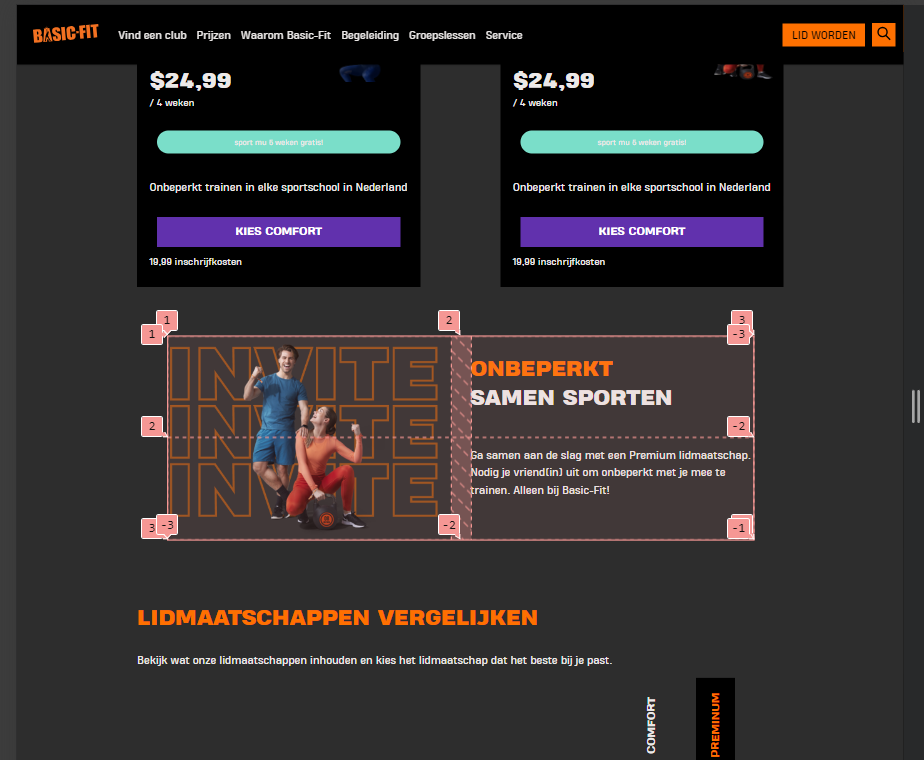
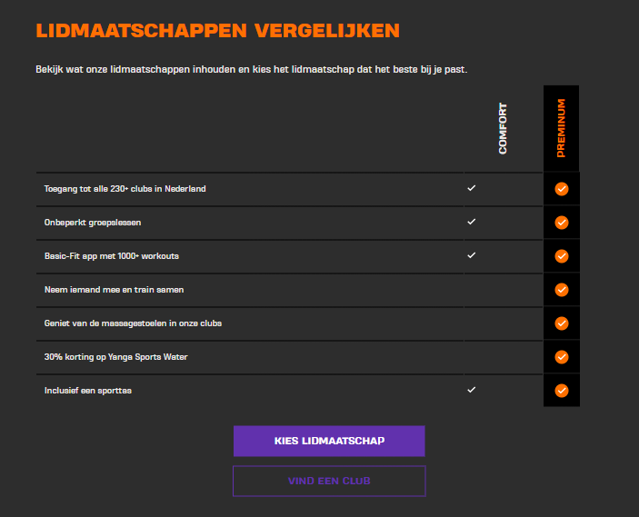
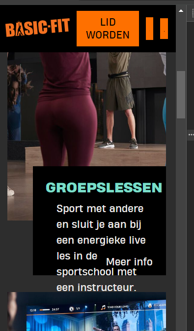

# Procesverslag
Markdown is een simpele manier om HTML te schrijven.  
Markdown cheat cheet: [Hulp bij het schrijven van Markdown](https://github.com/adam-p/markdown-here/wiki/Markdown-Cheatsheet).

Nb. De standaardstructuur en de spartaanse opmaak van de README.md zijn helemaal prima. Het gaat om de inhoud van je procesverslag. Besteedt de tijd voor pracht en praal aan je website.

Nb. Door *open* toe te voegen aan een *details* element kun je deze standaard open zetten. Fijn om dat steeds voor de relevante stuk(ken) te doen.

## Jij

  
uitwerken voor kick-off werkgroep

  ### Auteur:
  Matthew Doekhi

  #### Je startniveau:
  Rood

  #### Je focus:
  Responsive
 

## Je website

  
uitwerken voor kick-off werkgroep

  ### Je opdracht:
  https://www.basic-fit.com/nl-nl/prijs 

  #### Screenshot(s) van de eerste pagina (small screen): 
  Prijzen
  

  #### Screenshot(s) van de tweede pagina (small screen):
  Groepslessen 
  
 

## Toegankelijkheidstest 1/2 (week 1)

  
uitwerken na test in 2e werkgroep

  ### Bevindingen
  Lijst met je bevindingen die in de test naar voren kwamen:
  -Mijn website bevat veel errors.
  -Het bevat veel divs.
  -Het heeft geen/geen goede alt texten.
  -Tijdens de screenreader kan ik niet goed navigeren binnen de website want er komt geen border om dat deeltje die geselecteerd is.
  -Geen goede website voor mensen die screen reader gebruiken.

## Breakdownschets (week 1)

  
uitwerken na afloop 3e werkgroep

  ### de hele pagina: 
  

  ### dynamisch deel (bijv menu): 
  

  ### wellicht nog een dynamisch deel (bijv filter): 
  

## Voortgang 1 (week 2)

  
uitwerken voor 1e voortgang

  ### Stand van zaken
  hier dit ging goed & dit was lastig (neem ook screenshots op van delen van je website en code)

  ### Agenda voor meeting
  samen met je groepje opstellen

  | student 1      | student 2          | student 3    | student 4        |
  | stijn          | noa                | matthew      | zhafira          |
  | dit bespreken  | en dit             | en ik dit    | en dan ik dat    |
  | en dat ook nog | dit als er tijd is | nog een punt | dit wil ik zeker |
  | ...            | ...                | ...          | ...              |

  ### Verslag van meeting
  hier na afloop snel de uitkomsten van de meeting vastleggen

  - stijn vroeg wat hij moest doen als zijn website geen h1 heeft. en de antwoord was dat hij zelf een moet maken en zetten in zijn eigen website.
  - mijn vraag was om meer uitleg te krijgen over grid, en dat kreeg ik wel.
  - ook had ik een vraag over wat :after betekend, want de officiele website had dat erin.
  - daarnaast waren de rest van de vragen als de html etc goed is geschreven.

## Voortgang 2 (week 3)

  
uitwerken voor 2e voortgang

  ### Stand van zaken
  hier dit ging goed & dit was lastig (neem ook screenshots op van delen van je website en code)

  ### Agenda voor meeting
  samen met je groepje opstellen

  | student 1      | student 2          | student 3    | student 4        |
  | stijn          | zhafira            | matthew      | Sandra           |
  | dit bespreken  | en dit             | en ik dit    | en dan ik dat    |
  | en dat ook nog | dit als er tijd is | nog een punt | dit wil ik zeker |
  | ...            | ...                | ...          | ...              |

  ### Verslag van meeting
  hier na afloop snel de uitkomsten van de meeting vastleggen

  - sandra had gevraagd hoe ze der logo in het midden kon doen. en de docent heeft het stukje code geschreven en gewezen hoe.
  - a is voor navigeren, dus naar andere pagina of andere sectie
  - button is voor acties en geen nav
  - inspector gebruiken en niet op mobile view blijven maar steeds ermee spelen
  - als je iets onder elkaar wil dan parent op grid zetten
  - iets naast elkaar dan parent op flex
  - overflow hidden en visible
  - ook vroeg ik hoe ik een kleine lijn onder h5 kon zetten en de docent wees mij hoe het kan met :after.

## Toegankelijkheidstest 2/2 (week 4)

  
uitwerken na test in 9e werkgroep

  ### Bevindingen
  Lijst met je bevindingen die in de test naar voren kwamen (geef ook aan wat er verbeterd is):
  - mijn website heeft een paar errors, doordat de foto namen spatie ertussen hebben. dus heb ik dat opgelost.
  - me meer info knop moet een a zijn en geen button.
  - ik had geen dark mode
  - en ik had geen custom colors, nu wel.

## Voortgang 3 (week 4)

  
uitwerken voor 3e voortgang

  ### Stand van zaken
  hier dit ging goed & dit was lastig (neem ook screenshots op van delen van je website en code)

  ### Agenda voor meeting
  samen met je groepje opstellen

  | student 1      | student 2          | student 3    | student 4        |
  | stijn          | noa                | matthew      | zhafira          |
  | dit bespreken  | en dit             | en ik dit    | en dan ik dat    |
  | en dat ook nog | dit als er tijd is | nog een punt | dit wil ik zeker |
  | ...            | ...                | ...          | ...              |

  ### Verslag van meeting
  hier na afloop snel de uitkomsten van de meeting vastleggen

  - mijn 2 sections moesten in een ul zijn
  - mijn website zag er goed uit en de code ook.
  - ik vroeg hoe ik de checkmarks in het midden kon zetten, was wel gelukt maar de twede gedeelte niet.
  - stijn had gevraagd om website te veranderen dus had alleen html laten zien.
  - noa had ook nog gevraagd hoe zij haar nav in orde kon maken en hij hielp haar daarmee.

## Eindgesprek (week 5)

  
uitwerken voor eindgesprek

  ### Je uitkomst - karakteristiek screenshots:
  

  ### Dit ging goed/Heb ik geleerd: 
  Wat goed ging;
  - mijn website van dark en lightmode laten veranderen
  - mijn website responsive maken
  - ik heb geleerd met grid te werken.

  

  ### Dit was lastig/Is niet gelukt:
  wat lastig was/ niet gewerkt:
  - mijn tabel elementen in het midden zetten, een heeft gewerkt en de andere wil niet, want als ik display flex op doet dan gaat me hele table in de waar.

  

  - wat niet goed ging is dat me achtergrond kleur van mij text niet mee ging als me scherm klein werd.
  

  - en mijn footer naast elkaar zetten in 3 columns, want ik zou dan op de parent display flex moeten zeggen, maar als ik dat doe veranderd een klein stukje (eerste section) ook. dus zou ik een nav moeten zetten of een andere section om de 3 sections.
    

## Bronnenlijst

  
continu bijhouden terwijl je werkt

  Nb. Wees specifiek ('css-tricks' als bron is bijv. niet specifiek genoeg). 
  Nb. ChatGpT en andere AI horen er ook bij.
  Nb. Vermeld de bronnen ook in je code.

  1. ik heb code soms gehaald uit de basicfit website

